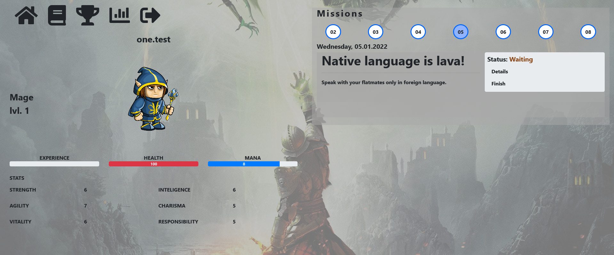
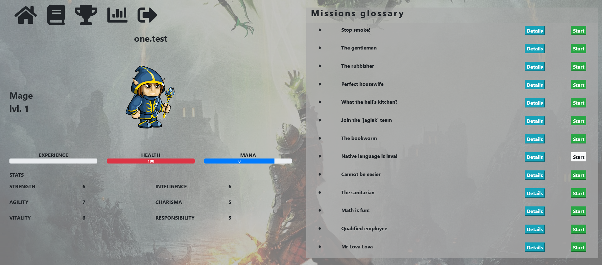
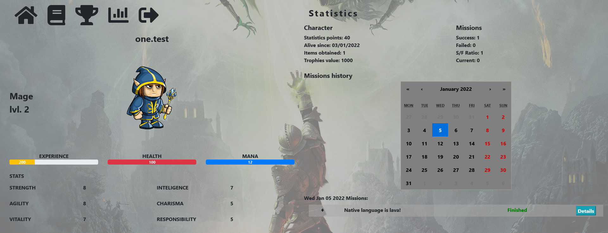
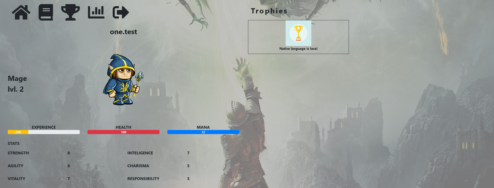
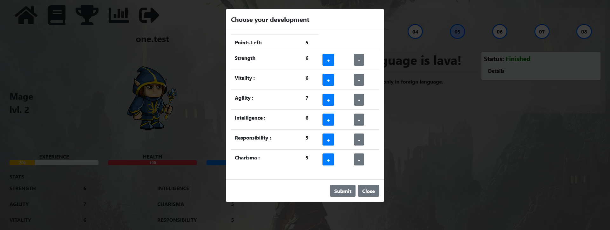

# self-discipline-rpg-app

> The goal of this project was to create a web-based application, which will help users to build their habits and productivity in look and behave like RPG style game. The application was built with React, styled with Boostrap and integrated with Firebase environment. Animation of the characters is based on react-sequence-animator library. React-calendar library is responsible for fully functional calendar component.<br/> > **Live demo here https://self-discipline-rpg-app.web.app/.<br/>
> For presentational purposes test user account has blocked permission to update character's data in the firebase database. I decided to implement it in this way to remain the character's base state between sessions. Test user credentials:**

- login: `one@test.com`
- password: `test1234`

## Table of Contents

- [Technologies Used](#technologies-used)
- [Features](#features)
- [Screenshots](#screenshots)
- [Setup](#setup)
- [Copyright claims](#copyright-claims)

## Technologies Used

- React - version 16.3.1
- Bootstrap - version 4.4.1
- Firebase - version 9.0.2
- formik version 2.2.9
- yup version 0.32.9
- react-calendar - version 3.0.1
- react-sequence-animator - version 1.0.0
- reactstrap - version 8.4.1

## Features

The application allows a logged in user with created character to perform actions specified below.

List of the features:

- Creation of the user's character (registration of the account), form build with the formik and yup libraries
- Taking quests from glossary
- Viewing character's statistics
- Checking trophies
- Leveling character
- Completing missions

## Screenshots







## Setup

### Requirements for development of the project:

- Node.js - version 16.13.1
- npm - version 7.6.3

1. Clone repository from github
2. Initialize project on the firebase platform and provide credentials to firebase application in React (link to documentation https://firebase.google.com/docs/web/setup).
3. Install all dependencies.

```bash
  npm install
```

4. Create a `.env` file and insert the following code. Replace values with credentials from firebase.

```javascript
REACT_APP_FIREBASE_API_KEY = "firebase-api-key";
REACT_APP_FIREBASE_AUTH_DOMAIN = "firebase-auth-domain";
REACT_APP_FIREBASE_PROJECT_ID = "firebase-project-id";
REACT_APP_FIREBASE_STORAGE_BUCKET = "firebase-storage-bucket";
REACT_APP_FIREBASE_MESSAGING_SENDER_ID = "firebase-messaging-sender-id";
REACT_APP_FIREBASE_APP_ID = "firebase-app-id";
REACT_APP_FIREBASE_MEASUREMENT_ID = "firebase-measurement-id";
```

5. Start the server and application.

```bash
  npm start
```

## Copyright claims

Items used in this project belong to their creators/authors and are not claimed by author of this project and people that use it.
